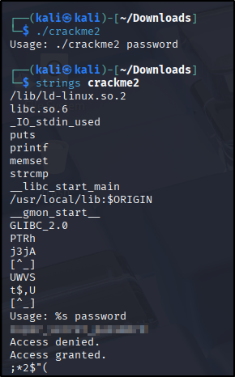

# 📝 Writeup – Reverse_ELF (TryHackMe)
---
## CrackMe1


An easy start just give permission and run the binary file.

---
## CrackMe2
      


Using ```strings``` to diplay readable txt

---
## CrackMe3
      

Decoding base64 txt we get flag

---
## CrackMe4
Just know basic assembly cmds like MOV, LEA, CMP, ADD, SUB, PUSH, POP, Je, Jmp, Jne, Test. For a list of useful assembly instructions, check out [Assembly Ops](./assembly_ops.md).

Now that we hv that cleared we open radare2
```bash
r2 -d crackme4
```
To run with argument,
```bash
r2 -d ./crackme4 <argument>
```
### cmds in r2: 
aaa(to search commands), afl (to search running functions), pdf @<function_name>,

db <Break_address> (breakpt),  dc (run with breakpt), px @<register_name> (value in register)

  

Run ```aaa``` then ```afl``` to list out all functions. We're always interested in the main function so ``pdf @main``.
In main we see sym.compare_pwd thats where the input string and passwd will be compared so ```pdf @sym.compare_pwd```.
Ignoring everything n going straight to call sym.imp.strcmp which is function compare to strings  . It takes two arguments 
rdi and rsi one of that is our input other will be the compared password. So if u see the value in the register at that instance 
one should contain the actual passwd. For that we set breakpoint ``db <address`` and run it using ``dc``


---
## CrackMe5
Same we'll use radare ```r2 -d crackme5```
```aaa```, ```pdf "main``` Search for function that c0mpare then set breakpt n run with it
    

We can also see that the passwd was infront of us

---
## CrackMe6
Same procedure got to main function then see for functions that are sus or are called before a desired outcome(like correct passwd).
For this its sym.my_secure_test. By looking at the code u can tell that its comparing each character of input with certain characters.
The value of that is displayed at the side in red by r2.

 


---
## CrackMe7
You can run the binary and see how things work im straight up going in r2 -d crackme8, pdf @main.
Ignoring all the code n going to the part where flag/passwd is decided

 

The user input is compared to a hex value 0x7a69 converting that into decimal and done


---
## CrackMe8
For this we going to use ghidra, which make its super easy and saves a lot of time. After creating a project on ghidra and import crackme8 in it.
Go to functions main,


You can try with r2 but ghidra just better. r2 is just good for understanding the basics reverse engineering will be useful somewhere....probably -_o

---
**NOTE**: Do tell if u find any mistakes....

⚠️ **Disclaimer:** This write-up is for educational purposes only. Do not use these techniques outside legal environments.
